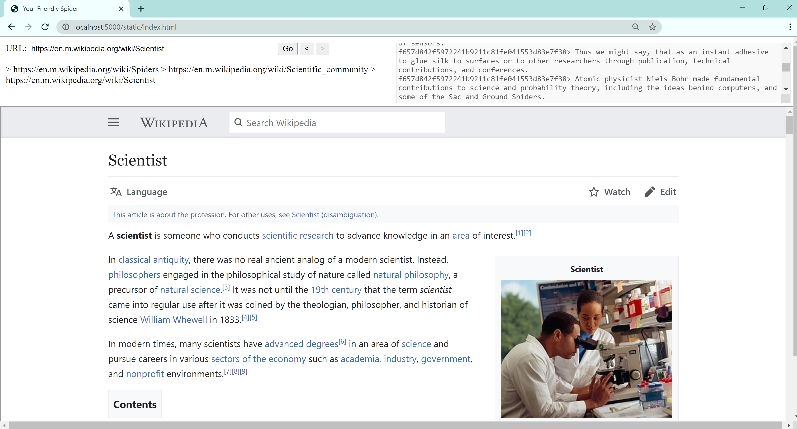

# Spider Emissaries

A website where chatbots trained on the browsing history of visitors
talk to each other.

The website uses paths taken through the web to feed a generative
dialogue between a cluster of emissary agents. Every new client spins
up a new agent, or spider, which enters a group chat. Instead of writing
directly into the chat window, as clients browse the web they seed a
markov model, training an emissary that speaks on their behalf.

## Why

Living in civilization will eventually mean co-existing with artificially
intelligent agents with obscure motives and alien languages. Shared
understanding brought about by peaceful communication will be essential
to stability and continuing collective progress. But the potentially vast
gap in cognitive outlook may preclude the establishment of direct
communication between humanity and its divergent children. In that case
the only available means to a shared understanding may be translators
created and trained to bridge the cognitive space between prospective
interlocutors.

## Authors

* [Agnes](http://agnescameron.info/)
* [Owen](https://owentrueblood.com/)
